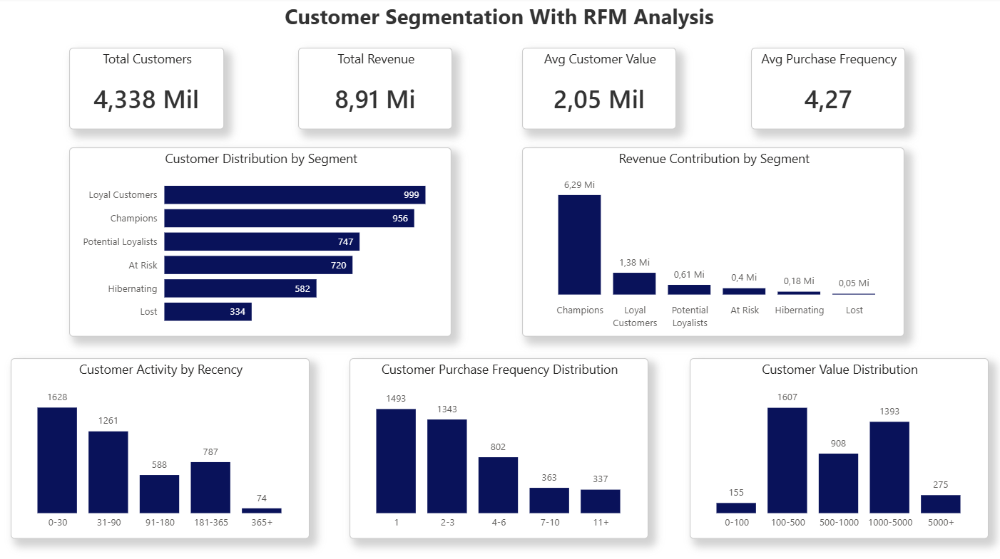

# RFM Customer Segmentation Analysis

## Business Problem

Customer segmentation is essential for understanding purchasing behavior and improving marketing efficiency. Companies often treat customers as a single group, which leads to inefficient campaigns and missed retention opportunities.

This project applies RFM (Recency, Frequency, Monetary) analysis to segment customers based on their purchase behavior and identify high-value groups that can support strategic decision-making in marketing, retention, and customer lifecycle management.

## Dataset

The dataset used in this project is the Online Retail Dataset, which contains transactional data from a UK-based online retailer between December 2010 and December 2011.

Main fields used:

- CustomerID
- InvoiceNo
- InvoiceDate
- Quantity
- UnitPrice

Dataset source:

https://archive.ics.uci.edu/ml/datasets/Online+Retail

## Tools & Technologies

This project was developed using:

- Google BigQuery – data storage and SQL transformations
- SQL – data cleaning, feature engineering, RFM calculation, segmentation
- Power BI – dashboard creation and visualization

## Project Workflow

All transformations were performed using SQL in Google BigQuery.
The scripts required to reproduce the pipeline are available in the */sql* directory.

The project follows a structured analytics pipeline:

### 1. Data Cleaning
Steps performed:

- removed null CustomerID values
- removed negative quantities (returns)
- removed transactions with UnitPrice equal to zero
- removed unnecessary columns (StockCode, Description, Country)

### 2. Feature Engineering
Created transaction-level revenue:
    
    TotalAmount = Quantity × UnitPrice

### 3. RFM Metrics Calculation
For each customer:

- **Recency** → days since last purchase
- **Frequency** → number of distinct invoices
- **Monetary** → total revenue generated

Reference date used:
    
    2011-12-10
(one day after the last transaction in the dataset)

### 4. RFM Scoring
Customers were ranked using quintiles (1–5 scale):

- lower recency → higher score
- higher frequency → higher score
- higher monetary value → higher score

Final score range:

    3 to 15

### 5. Customer Segmentation
Customers were grouped into behavioral segments:

Segment	   Description
Champions	Most recent, frequent and highest-spending customers
Loyal Customers	High purchase frequency and consistent engagement
Potential Loyalists	Customers with strong potential to become loyal
At Risk	Previously valuable customers showing reduced activity
Hibernating	Low engagement and infrequent purchases
Lost	Customers unlikely to return

| **Segment**         | **Description**                                        |
| -------             | -----                                                  |
| Champions           | Most recent, frequent and highest-spending customers   |
| Loyal Customers     | High purchase frequency and consistent engagement      |
| Potential Loyalists | Customers with strong potential to become loyal        |
| At Risk             | Previously valuable customers showing reduced activity |
| Hibernating         | Low engagement and infrequent purchases                |
| Lost                | Customers unlikely to return                           |

## Dashboard Overview

The dashboard provides three analytical layers:

**Executive KPIs**

- Total Customers
- Total Revenue
- Average Customer Value
- Average Purchase Frequency

**Customer Segmentation Analysis**

- Customer distribution by segment
- Revenue contribution by segment

**Behavioral Distribution Analysis**

Customer distributions across:

- Recency
- Frequency
- Monetary

These views highlight engagement levels, purchase patterns, and revenue concentration across the customer base.

## Key Insights
Main findings from the analysis:

- Champions represents 22% of customers and generate the largest share of total revenue 70,5%
- Loyal Customers are the biggest group (23%), but generate only 15% of total revenue
- Most customers purchase only once or 2-3 times
- High-value customers show strong recency and frequency patterns

## Dashboard Preview
Example:

## Business Applications
This segmentation framework can support:

- personalized marketing campaigns
- customer retention strategies
- churn prevention initiatives
- loyalty program targeting
- revenue optimization strategies

---